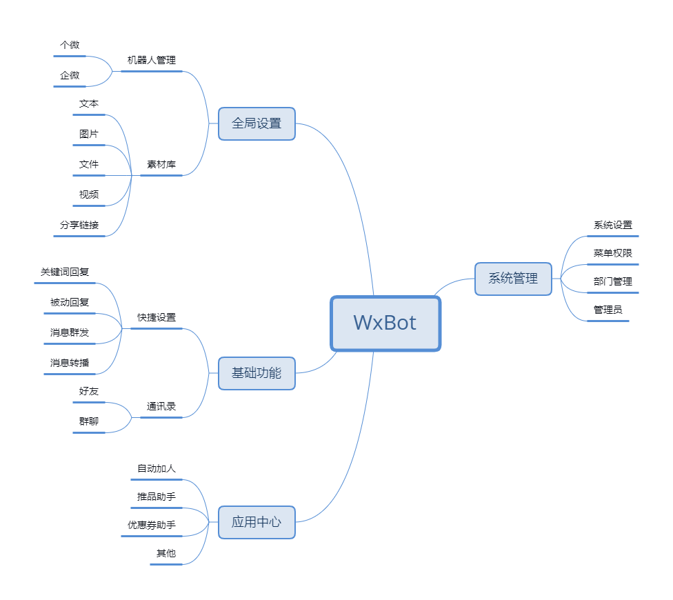
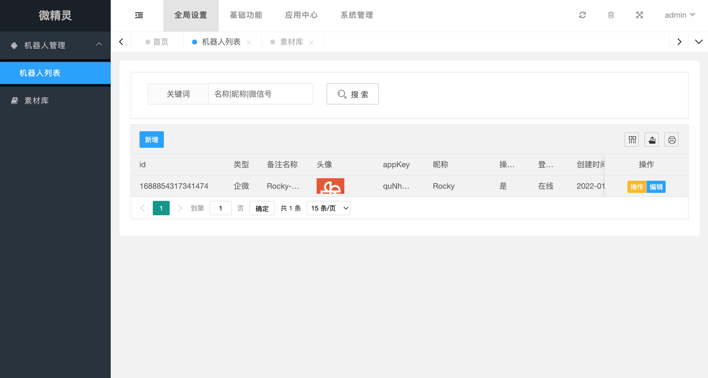
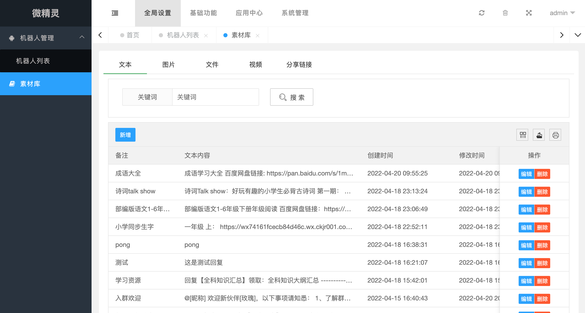
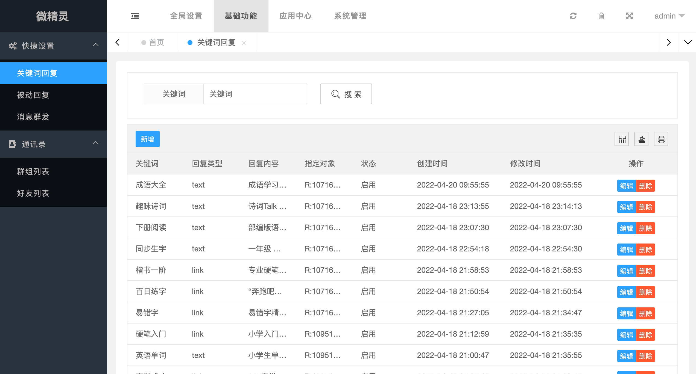
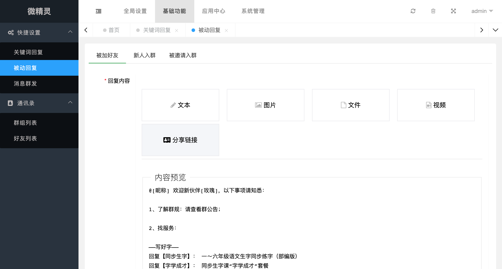
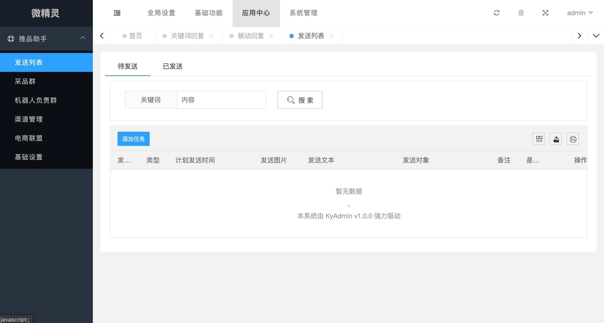
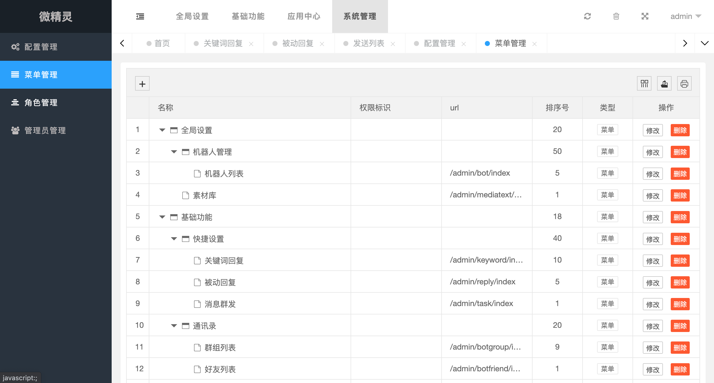

# [Wxbot](http://daoadmin.kuryun.com/home/guide/bot.html)

#### 介绍
基于thinkphp6的多商户多微信号的私域社群运营web系统。

#### 系统特性

- 基础功能： 好友操作相关功能、群聊操作相关功能
- 多驱动：系统支持多机器人框架驱动，目前支持了西瓜框架、可爱猫、e小天、我的（个微和企微）、VLW（个微和企微）、Web微信。
- 多商户： 开放注册，站长可以设置商户默认支持的微信个数和时长
- 变现：支持按微信号席位收费（席位+时长）
- 权限管理：完整的权限管理，每个客户拥有自己的组织权限管理
- 应用市场：除了应用市场提供的免费+付费应用，开发者可以基于此系统进行满足自身业务需求的应用开发，并上架应用市场进行变现
- 二开：代码全开源，方便二开。

#### 体验链接：
请在PC端打开

[http://wxbot.oudewa.cn/](http://wxbot.oudewa.cn/)（账号：test， 密码：123456）

#### 功能地图：

#### 免费应用：
    
- 自动加好友并拉群
- AI聊天（支持微信OpenAI、chatgpt、青云客AI）
- 电商转链助手
- 优惠券助手
    
#### 界面截图：

#### 软件架构
- [ThinkPHP6](https://www.kancloud.cn/manual/thinkphp6_0/)
- Mysql
- Memcached & Redis
- [Layui](https://www.layui.com/) 
- [Layuimini](http://layuimini.99php.cn/)
- [e小天](http://www.wxext.cn)
- [Vlw](http://a.vlwai.cn/)
- [Vlw配套接口Xyo](https://www.yuque.com/httpapi/)
- [Web微信(Go-wxbot)](https://gitee.com/fudaoji/go-wxbot)

#### 安装及使用文档

开发文档：[http://daoadmin.kuryun.com/home/guide/bot/id/74/v/1.x.html](https://kyphp.kuryun.com/home/guide/bot/id/74/v/1.x.html)

#### 参与贡献

1.  Fork 本仓库
2.  新建 dev 分支
3.  提交代码
4.  新建 Pull Request

#### 交流
如果对您有帮助，麻烦star走一波，感谢！

QQ交流群：
726177820

微信交流群：

#### 声明
本项目仅供技术研究，请勿用于任何商业用途，请勿用于非法用途，如有任何人凭此做何非法事情，均于作者无关，特此声明。